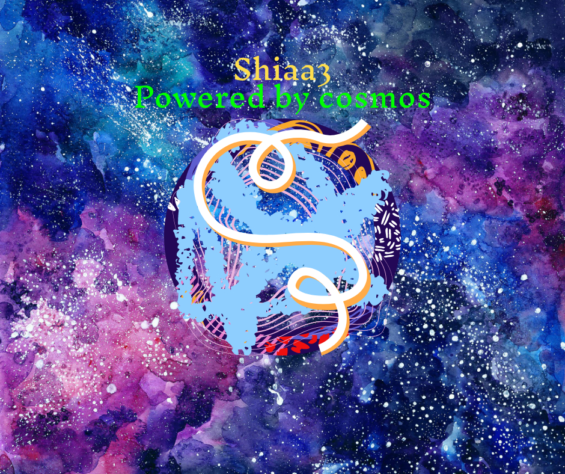

# shiaa3

**shiaa3** is a blockchain built using Cosmos SDK and Tendermint and created with [Starport](https://github.com/tendermint/starport).

**Shiaa3** is an implementation of NFT in cosmos-sdk. The native NFTs of shiaa3 is called as 
Assets

Assets can be of 5 kinds in shiaa3

− CAMEL (50 Tokens)

− HOUSE (200 Tokens)

− FOSSIL NECKLACE (100 Tokens)

− TERACOTTA LAMP (5 Tokens)

− CERAMIC PLATE (10 Token

The Assets are non-standard NFT and is inspired from the game of catan. They are like 
cards in the game of catan. But nevertheless as a property of NFT its ownership can be 
transferred and it can be burnt.

Another important aspect of it is Assets can be transferred over assets port over a 
channel, given both chains at endpoints has assets module enabled in app.go

**The monetary policies**

◼ Assets can be transferred and sending your assets to other people earns you 20% of 
the base amount as a reward, always.

◼ Assets can be staked in a pool of a club. The club has got 5 pool, [0, 1, 2, 3, 4]. To 
enter into a pool an asset need to be staked.

◼ Pools has different limit pool-0 and pool-1 supports 2 player 

◼ Pool-2 and pool-3 supports 3 players 

◼ Pool-4 supports 5 players

◼ Each pool plays a game of shai . The winner in this game becomes the owner of 
all assets staked in the pool.

